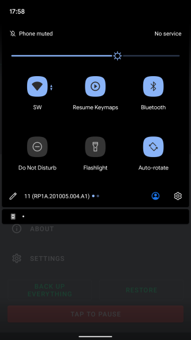

There are many ways to pause and resume your mappings. These are very useful features because they allow to easily turn off your key maps if you don't need to use them.

### Use the notification


### Use the quick settings tile



### Pause/resume key maps with the Intent API (2.3.0+)

This will allow other apps to pause and resume your mappings by broadcasting an Intent to Key Mapper. The properties for the Intent are shown below

#### Action (choose one)
```
io.github.sds100.keymapper.ACTION_PAUSE_MAPPINGS
```
```
io.github.sds100.keymapper.ACTION_RESUME_MAPPINGS
```
```
io.github.sds100.keymapper.ACTION_TOGGLE_MAPPINGS
```
  
#### Package

```
io.github.sds100.keymapper
```

Add `.debug` or `.ci` to the end of the package name if you are using a debug or ci build of Key Mapper.

#### Class

```
io.github.sds100.keymapper.api.PauseMappingsBroadcastReceiver
```

### Enable/disable key maps with the Intent API (4.0.0+)

This will allow other apps to enable and disable a key map by broadcasting an Intent to Key Mapper. The properties for the Intent are shown below

#### Action (choose one)
```
io.github.sds100.keymapper.ACTION_ENABLE_KEY_MAP
```
```
io.github.sds100.keymapper.ACTION_DISABLE_KEY_MAP
```
```
io.github.sds100.keymapper.ACTION_TOGGLE_KEY_MAP
```

### String extra (mandatory)

```
io.github.sds100.keymapper.EXTRA_KEYMAP_UID
```
  
#### Package

```
io.github.sds100.keymapper
```

Add `.debug` or `.ci` to the end of the package name if you are using a debug or ci build of Key Mapper.

#### Class

```
io.github.sds100.keymapper.api.EnableKeyMapsBroadcastReceiver
```