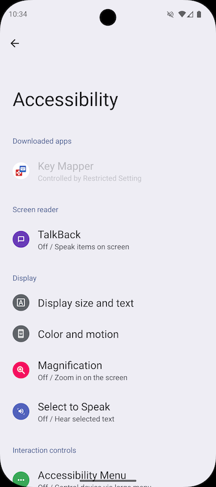
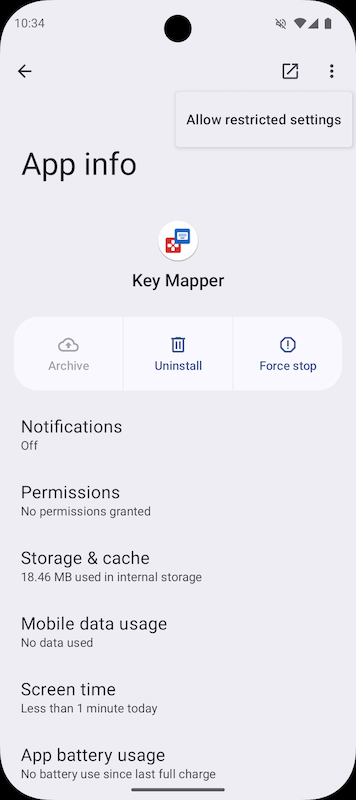

If you downloaded the APK from outside the Play store then you may need to allow **restricted settings**. These instructions may be slightly different on your device.

1. First try enabling the accessibility service by tapping on the Key Mapper listing.

    

2. Go to Apps
3. Find Key Mapper in list and open it.
4. Tap the menu button in the upper right corner. It opens a menu with the option "allow restricted settings"; tap it.

    

5. Read the warnings and accept them.
6. Go back to the accessibility settings and turn on the accessibility service as normal.